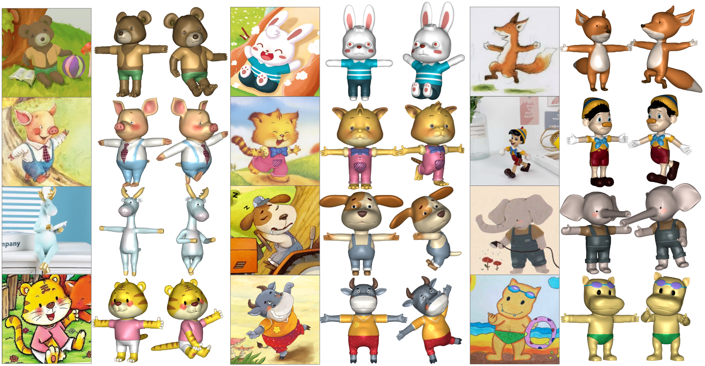

# *RaBit*

> ***RaBit***: Parametric Modeling of 3D Biped Cartoon Characters with a Topological-consistent Dataset
>
> Zhongjin Luo*, Shengcai Cai*, Jinguo Dong, Ruibo Ming, Liangdong Qiu, [Xiaohang Zhang](https://xiaohangzhan.github.io/) and [Xiaoguang Han](https://gaplab.cuhk.edu.cn/)

#### | [Paper](https://arxiv.org/abs/2303.12564) | [Project](https://gaplab.cuhk.edu.cn/projects/RaBit/) | [Dataset](https://gaplab.cuhk.edu.cn/projects/RaBit/dataset.html) |

## TODO:triangular_flag_on_post:

- [ ] Datasets
- [ ] Shape Model
- [ ] Texture Model
- [ ] Usage Guidance / Demo

## Introduction


Assisting people in efficiently producing visually plausible 3D characters has always been a fundamental research topic in computer vision and computer graphics. Recent learning-based approaches have achieved unprecedented accuracy and efficiency in the area of 3D real human digitization. However, none of the prior works focus on modeling 3D biped cartoon characters, which are also in great demand in gaming and filming. In this paper, we introduce *3DBiCar*, the first large-scale dataset of 3D biped cartoon characters, and *RaBit*, the corresponding parametric model. Our dataset contains 1,500 topologically consistent high-quality 3D textured models which are manually crafted by professional artists. Built upon the data, *RaBit* is thus designed with a SMPL-like linear blend shape model and a StyleGAN-based neural UV-texture generator, simultaneously expressing the shape, pose, and texture. To demonstrate the practicality of *3DBiCar* and *RaBit*, various applications are conducted, including single-view reconstruction, sketch-based modeling, and 3D cartoon animation. Please refer to our [project page](https://gaplab.cuhk.edu.cn/projects/RaBit/) for more demonstrations.

## *3DBiCar*

*3DBiCar* spans a wide range of 3D biped cartoon characters, containing 1,500 high-quality 3D models. We firstly carefully collect images of 2D full-body biped cartoon characters with diverse identities, shape, and textural styles from the Internet, resulting in 15 character species and 4 image styles. Then we recruit six professional artists to create 3D corresponding character models according to the collected reference images. To use our dataset, please refer to [*3DBiCar*](https://gaplab.cuhk.edu.cn/projects/RaBit/dataset.html) for instructions.



## Install

- To use *RaBit*'s shape model, please run the following commands,

  ```
  conda create --name RaBit -y python=3.8
  conda activate RaBit
  pip install -r requirements.txt
  ```

- To use *RaBit*'s texture model, you also need to meet the requirements of [StyleGAN3](https://github.com/NVlabs/stylegan3).

## **Usage of *RaBit***

*RaBit is* a 3D full-body parametric model for biped character modeling, which contains a linear blend (SMPL-like) model for shapes and a neural (StyleGAN-based) generator for UV textures. It simultaneously parameterizes the shape, pose, and texture of 3D biped characters into low-dimensional vectors.

- Downloading required models and extra data from [Google Drive](https://drive.google.com/file/d/1yvweTYPKtmuMt5Eu7CHZ4-Do4CRYLFtp/view?usp=sharing) or [OneDrive](https://cuhko365-my.sharepoint.com/:u:/g/personal/220019015_link_cuhk_edu_cn/EfrbrGVpsUlDuE4zZDfsJlIB-QzgUDb9GZO9MInG0ecWkQ?e=kC79nL). After unzipping the above file, the directory structure of `./rabit_data` is expected as follows,

  ```
  ├── assets
  ├── rabit_data
  │   ├── eyes
  │   │   ├── eye_params.npy
  │   │   ├── one_eye.obj
  │   │   ├── orbit_annotation.ply
  │   │   └── template_eyes.obj
  │   ├── shape
  │   │   ├── clusterdic.npy
  │   │   ├── joint2index.npy
  │   │   ├── ktree_table.npy
  │   │   ├── maxmin.npy
  │   │   ├── mean.obj
  │   │   ├── pcamat.npy
  │   │   ├── pose_order.npy
  │   │   ├── toe_tumb_nose_ear.npy
  │   │   └── weight_matrix.npy
  │   ├── texture # trained texture generator
  │   │   └── texture.pkl
  │   └── UV
  │       ├── m_t.mtl
  │       ├── quad.obj # quadmesh
  │       └── tri.obj # trimesh
  ├── ...
  ```

   `shape/` contains files for the shape blend model, `texture/` for the texture generator, `eyes/` for eye computation, and `UV/` for UV mapping.

- We provide a numpy implementation of *RaBit*. For generating a random mesh without texture:

  ```
  python rabit_np.py
  ```

  The generated mesh would be saved to the `output/m.obj`.

- For generating a random mesh with texture:

  ```
  python rabit_np_with_texture.py
  ```

  The generated mesh would be saved to the `output/m_t.*`.

- You can also refer to the provided files [rabit_demo.ipynb](https://github.com/zhongjinluo/RaBit/blob/master/rabit_demo.ipynb) and [rabit_demo_with_texture.ipynb](https://github.com/zhongjinluo/RaBit/blob/master/rabit_demo_with_texture.ipynb) for instructions on generating a random mesh without and with texture, respectively.

- We also provide a GUI viewer that allows intuitive manipulation of the first ten shape axes of *RaBit*:

  ```
  python app.py
  ```
  
  

## Citation

```
@inproceedings{luo2023rabit,
  title={RaBit: Parametric Modeling of 3D Biped Cartoon Characters with a Topological-consistent Dataset},
  author={Luo, Zhongjin and Cai, Shengcai and Dong, Jinguo and Ming, Ruibo and Qiu, Liangdong and Zhan, Xiaohang and Han, Xiaoguang},
  booktitle={Proceedings of the IEEE/CVF Conference on Computer Vision and Pattern Recognition (CVPR)},
  year={2023}
}
```

## Acknowledgements

The code benefits from or utilizes the following projects. Many thanks to their contributions.

- [SMPL](https://smpl.is.tue.mpg.de/)
- [CalciferZh/SMPL](CalciferZh/SMPL)
- [Humberto1015/smpl-viewer](https://github.com/Humberto1015/smpl-viewer)
- [thmoa/smpl_viewer](https://github.com/thmoa/smpl_viewer)